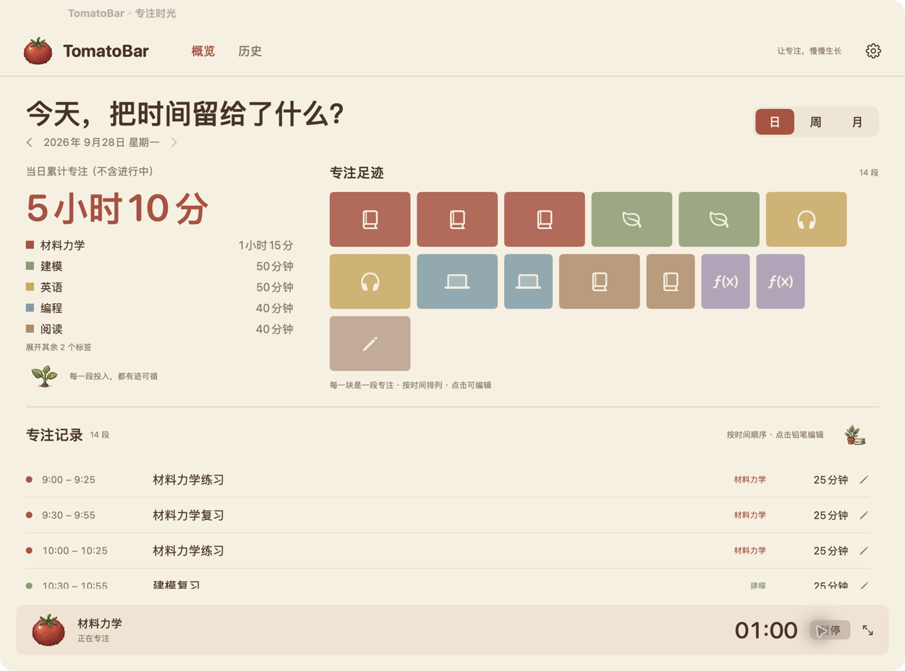

<div align="center">


# TomatoBar Personal

macOS 菜单栏番茄钟 · [TomatoBar](https://github.com/ivoronin/TomatoBar) 的个人定制 fork

完全无声 · 事件记录 · 日／周／月复盘

[](https://github.com/mikilolipop/TomatoBar-Personal/actions/workflows/main.yml)
[](https://github.com/mikilolipop/TomatoBar-Personal/releases/latest)
[](https://mikilolipop.github.io/TomatoBar-Personal/)


[](LICENSE)

</div>



*主窗口日视图（截图为示例数据）*

## 这是什么

[TomatoBar](https://github.com/ivoronin/TomatoBar) 是一款优秀的 macOS 菜单栏番茄钟。
这个 fork 在保留其轻量风格的基础上，把它改造成一个**安静、可回溯的专注记录工具**：

- **完全无声** — 移除了全部音频播放代码与素材，休息也从不发出声音
- **事件记录** — 每段专注可以填写名称、多个标签与分类，结束后仍可编辑或删除
- **暂停／继续** — 工作与休息均可暂停，睡眠与退出自动暂停
- **无声置顶提醒** — 时段结束弹出置顶确认窗，不依赖系统通知授权
- **本地持久化** — 历史记录原子写入 `~/Library/Application Support/TomatoBarPersonal/sessions.json`，
  无网络请求、无遥测，数据不出这台 Mac
- **原生主窗口** — 日／周／月三种视图复盘：色块流、堆叠柱、热力日历，像素风动画
- **可与原版共存** — 独立 Bundle ID（`com.dilyar.TomatoBarPersonal`）与独立数据目录

界面文案目前为硬编码中文。

## 版本

| 版本 | 内容 |
|---|---|
| V1.3.2（3.9.2） | 修复记录编辑器主分类下拉箭头点击无响应。[更新说明](docs/V1.3.2更新说明.md) |
| V1.3.1（3.9.1） | 待办、分类配色、数值输入及 UI 精修；包含近期存储和计时修复。[更新说明](docs/V1.3.1更新说明.md) |
| V1.3（3.9.0） | 删除单条记录；分类入口常驻、可选图标。[更新说明](docs/V1.3更新说明.md) |
| V1.2（3.8.0） | 原生主窗口，日／周／月复盘，紧凑与大倒计时。[更新说明](docs/V1.2更新说明.md) |
| V1.1（3.7.1） | 记录改名、多标签与标签筛选。[更新说明](docs/V1.1更新说明.md) |
| V1.0（3.7.0） | 事件记录、暂停/继续、完全无声、到时确认提醒。[使用与验证](docs/个人版使用与验证.md) |

## 安装

**下载最新版**：前往 [Releases](https://github.com/mikilolipop/TomatoBar-Personal/releases/latest)，任选一种形式（均支持 Apple Silicon 与 Intel）：

| 文件 | 用法 |
|---|---|
| `TomatoBarPersonal-<版本>.dmg` | 打开后把番茄图标拖进 Applications |
| `TomatoBarPersonal-<版本>.zip` | 解压后把 app 移入 Applications |
| Source code (tar.gz/zip) | GitHub 自动附带，从源码构建 |

GitHub 下载包使用 ad-hoc 签名，未做付费公证。首次打开若被 Gatekeeper 拦截：

```sh
xattr -dr com.apple.quarantine "/Applications/TomatoBar Personal.app"
```

也可以直接从源码构建（需要 Xcode 与 Command Line Tools）：

```sh
git clone https://github.com/mikilolipop/TomatoBar-Personal.git
cd TomatoBar-Personal
./scripts/build.sh                 # Release 构建 + 严格签名校验
open "/tmp/TomatoBar-personal-build/Build/Products/Release/TomatoBar Personal.app"
```

本机源码构建使用项目的 Automatic Personal Team 开发签名，默认同时构建 Apple Silicon 与 Intel。
公开下载包从同一产物制作副本并重签为 ad-hoc，不携带本机开发签名。
若从其他位置拷贝后被 Gatekeeper 拦截：

```sh
xattr -dr com.apple.quarantine "/Applications/TomatoBar Personal.app"
```

## 开发

```sh
./scripts/test.sh                  # 领域层测试（无需签名，CI 同款）
./scripts/test-bridge.sh           # 桥接层测试（真实依赖 + 临时 QA 目录）
./scripts/build.sh                 # Release 构建
```

- 领域层（状态机、存储、统计）与 UI 分离，`test.sh` 只编译领域层，秒级完成
- 默认分支为 **`feature/personal-focus`**；`main` 是冻结的上游基线，只用于 diff
- 提交前 `scripts/test.sh` 必须全绿
- 更多约定见 [`AGENTS.md`](AGENTS.md)，演进记录见 [`docs/HANDOFF.md`](docs/HANDOFF.md) 与 [`docs/BACKLOG.md`](docs/BACKLOG.md)

## 与外部工具的集成

可以用 URL scheme 从命令行或自动化工具启停计时：

```sh
open tomatobar-personal://startStop
```

## 鸣谢

感谢第一批客户 **nafi**、**Chiwawa** 和 **ElF**。

谢谢你们在 TomatoBar Personal 起步时给予的信任与支持。

## 许可与致谢

- 基于 [Ilya Voronin 的 TomatoBar](https://github.com/ivoronin/TomatoBar)（[MIT License](LICENSE)），
  个人版改动同样以 MIT 发布；上游的全部提交者贡献保留在 Git 历史中
- 像素插画与动画为本 fork 制作的资源（上游项目中不存在）
- 感谢 [ivoronin](https://github.com/ivoronin) 创造了干净的起点
